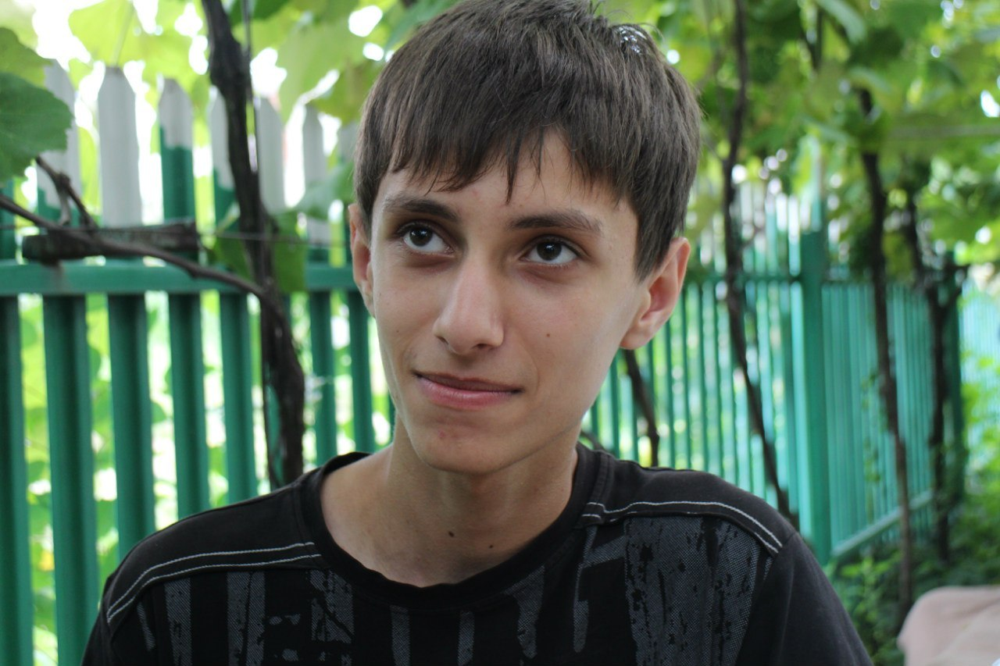

# Open CV
1. [PDF](./EN_Covaliuc_Dionisie_Optimized.pdf)
2. [JPG](./EN_Covaliuc_Dionisie.jpg) (If you have problems with PDF)

There is text version below if you have problems with both of formats.
# Covaliuc Dionisie
> Front-end developer

I’m 18, live in Moldova,
I want to become a **fullstack web-developer**.
My favorite language is Python.

I’m searching for any kind of job which is related with front-end web
development. It can be part or full time job, no matter. Also the
possibility of remote work will be a pleasure for me...

## Work experience
> *01/12/2017*
> **Private game server Magic of Gods**
> *(non-commercial)*
>
> In my responsibilities was:
> * Web design (HTML, CSS, Sass, Pug, Gulp)
>  * Front-end part of donate page (JavaScript, jQuery)
>  * Back-end part of donate (Python, Flask, SQL)
>  * Digital design (Photoshop)
>
> **Link:** [https://magicofgods.ru](https://magicofgods.ru)

## Skills
Languages & Frameworks:
* Python - 3/5
* JavaScript - 2/5
* HTML/CSS - 4/5
* jQuery - 3/5
* Bootstrap - 3/5

Tools:
* Git - 3/5
* Jade (Pug) - 4/5
* Sass - 3/5

Others:
* **StackOverflow - 5/5**

## Education
> *01/09/2017*
>
> **Polytechnic College**
>
> *Balti, Moldova*

> *01/09/2006 -- 31/05/2015*
>
> **Liceum A. S. Pushkin**
>
> *Falesti, Moldova*

## Languages
* English - 3/5
* Russian - 5/5
* Romanian - 3/5

# Other info
## Personal
**Date of birth:** 14/10/1999

**Country:** Moldova

**Age:** 18

## Contacts
**GitHub:** [@powerslime](https://github.com/PowerSlime)

**VK:** [@powerslime](https://vk.me/powerslime)

**Telegram:** [@powerslime](https://t.me/powerslime)

*There is no e-mail, because bots instantly will add it to their database... I don't want to receive a lot of spam.*

# Portfolio
Don’t forget to check my personal page, there are some examples of my works:

[https://powerslime.github.io/](https://powerslime.github.io/)
