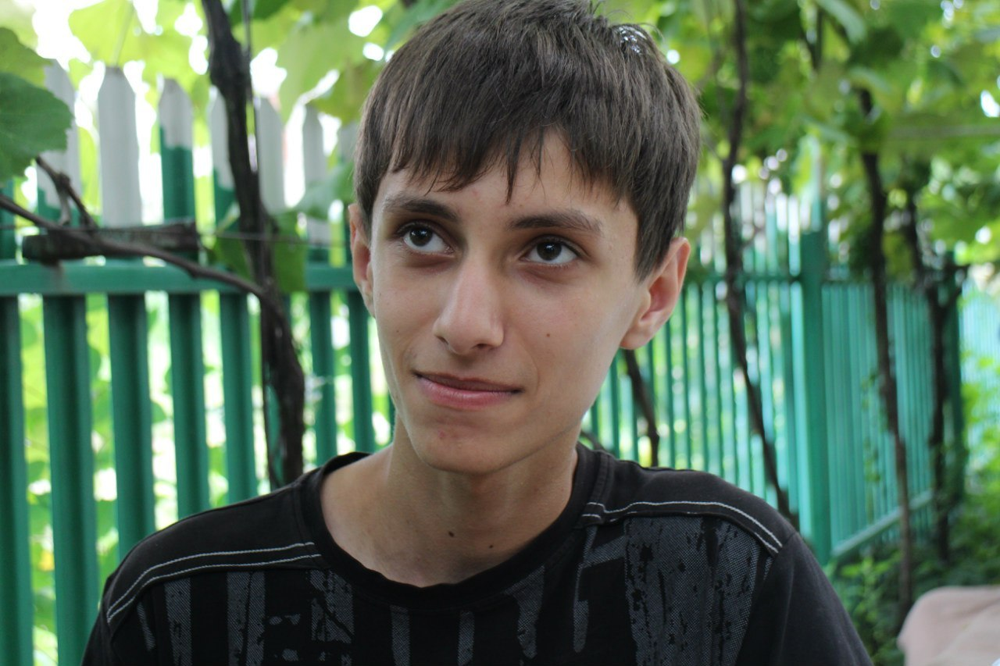

# Откройте CV
1. [PDF](./RU_Covaliuc_Dionisie_Optimized.pdf)
2. [JPG](./RU_Covaliuc_Dionisie.jpg) (Если есть проблемы при открытии PDF)

Ниже текстовая версия, на случай, если проблемы с открытием обоих форматов.
# Covaliuc Dionisie
> Front-end разработчик

Мне 18 лет, живу в Молдове.
Я хочу стать **fullstack web-разработчиком**.
Мой любимый язык - Python.

Я ищу любую работу, которая связанна с front-end веб-разработкой.
Это может быть частичная или полная занятость, не важно. Так же
возможность удаленной работы будет приятна для меня...

## Опыт работы
> *01/12/2017*
> **Приватный игровой сервер Magic of Gods**
> *некоммерческий*
>
> В мои обязанности входило:
> * Верстка страниц (HTML, CSS, Sass, Pug, Gulp)
> * Front-end часть стрицы донатов (JavaScript, jQuery)
> * Back-end часть обработки донатов (Python, Flask, SQL)
> * Цифровой дизаин (Photoshop)
>
> **Ссылка:** https://magicofgods.ru

## Навыки
Языки и фреймворки:
* Python -- 3/5
* JavaScript -- 2/5
* HTML/CSS -- 4/5
* jQuery -- 3/5
* Bootstrap -- 3/5

Инструменты:
* Git -- 3/5
* Jade (Pug) -- 4/5
* Sass -- 3/5

Другое:
* **StackOverflow -- 5/5**

## Образование
> *01/09/2017*
> **Политехнический колледж**
> *Бельцы, Молдова*

> *01/09/2006 -- 31/05/2015*
> **Лицей им. А. С. Пушкина**
> *Фалешты, Молдова*

## Языки
* Английский -- 3/5
* Русский -- 5/5
* Румынский -- 3/5

# Другое
## Персональная информация
**Дата рождения:** 14/10/1999
**Страна:** Молдова
**Возраст:** 18

## Контакты
**GitHub:** [@powerslime](https://github.com/PowerSlime)
**VK:** [@powerslime](https://vk.me/powerslime)
**Telegram:** [@powerslime](https://t.me/powerslime)
*Здесь нет e-mail'а, потому что боты моментально добавят его в свои базы данных... Я не хочу получать еще больше спама.*

# Портфолио
Не забывайте посмотреть мою страницу, там есть несколько примеров моих работ:
https://powerslime.github.io/
